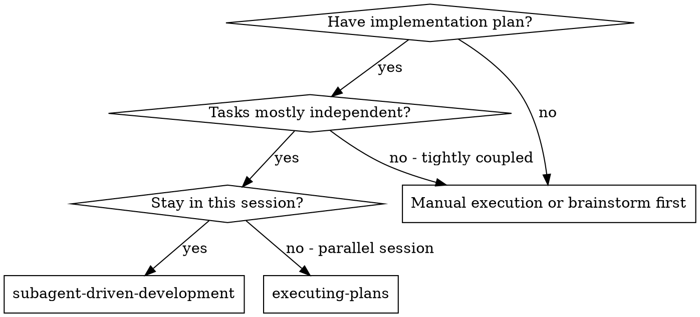
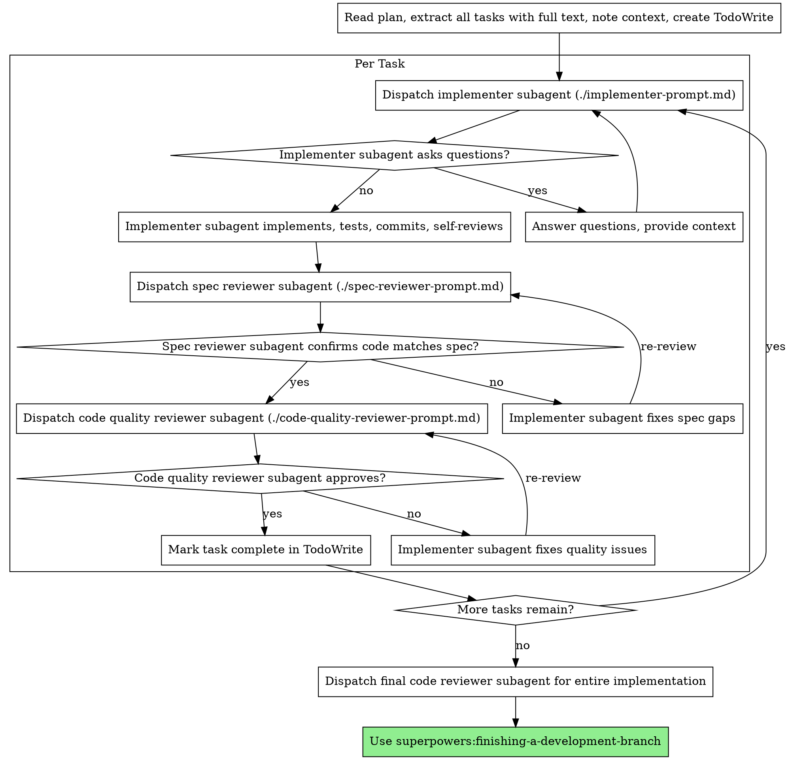

# Subagent-Driven Development

Execute plan by dispatching fresh subagent per task, with two-stage review after each: spec compliance review first, then code quality review.

**Why subagents:** You delegate tasks to specialized agents with isolated context. By precisely crafting their instructions and context, you ensure they stay focused and succeed at their task. They should never inherit your session's context or history — you construct exactly what they need. This also preserves your own context for coordination work.

**Core principle:** Fresh subagent per task + two-stage review (spec then quality) = high quality, fast iteration

**Continuous execution:** Do not pause to check in with your human partner between tasks. Execute all tasks from the plan without stopping. The only reasons to stop are: BLOCKED status you cannot resolve, ambiguity that genuinely prevents progress, or all tasks complete. "Should I continue?" prompts and progress summaries waste their time — they asked you to execute the plan, so execute it.

## When to Use



**vs. Executing Plans (parallel session):**
- Same session (no context switch)
- Fresh subagent per task (no context pollution)
- Two-stage review after each task: spec compliance first, then code quality
- Faster iteration (no human-in-loop between tasks)

## The Process



## Model Selection

Two rules. The first is about cost and fit; the second is about review quality.

**Rule 1 — Match model strength to task complexity.** Use the least powerful model that can do the job. Stronger models are slower and more expensive; reserve them for work that actually needs them.

Complexity signals:
- Mechanical work — isolated function, clear spec, 1-2 files → cheap/fast tier.
- Integration work — multi-file coordination, pattern matching, debugging → mid tier.
- Architecture, design judgment, broad codebase reasoning, reviews → strongest tier available.

**Rule 2 — Reviewer model family must differ from implementer model family.** If the implementer and a reviewer share a model family, they share blind spots: the reviewer is biased to accept exactly what the implementer produced. Pick a different model family for at least one of the two reviewers (spec reviewer or code-quality reviewer). Diversity catches drift that raw capability does not.

Operationally: when you dispatch subagents, pass an explicit model identifier for each role. Do not rely on harness defaults. Record the choice in `progress.md` so the audit trail is reproducible.

This skill is model-agnostic — it does not name specific model versions. Apply the two rules above using whatever models your orchestrator harness exposes.

## Handling Implementer Status

Implementer subagents report one of four statuses. Handle each appropriately:

**DONE:** Proceed to spec compliance review.

**DONE_WITH_CONCERNS:** The implementer completed the work but flagged doubts. Read the concerns before proceeding. If the concerns are about correctness or scope, address them before review. If they're observations (e.g., "this file is getting large"), note them and proceed to review.

**NEEDS_CONTEXT:** The implementer needs information that wasn't provided. Provide the missing context and re-dispatch.

**BLOCKED:** The implementer cannot complete the task. Assess the blocker:
1. If it's a context problem, provide more context and re-dispatch with the same model
2. If the task requires more reasoning, re-dispatch with a more capable model
3. If the task is too large, break it into smaller pieces
4. If the plan itself is wrong, escalate to the human

**Never** ignore an escalation or force the same model to retry without changes. If the implementer said it's stuck, something needs to change.

## Prompt Templates

- `./implementer-prompt.md` - Dispatch implementer subagent
- `./spec-reviewer-prompt.md` - Dispatch spec compliance reviewer subagent
- `./code-quality-reviewer-prompt.md` - Dispatch code quality reviewer subagent

## Folder layout (where artifacts live)

**Precondition (fail loud):** the plan path passed to this skill MUST match the shape:

```
thoughts/tasks/<task-slug>/plans/<plan-slug>.md
```

If the path does not match (wrong root, missing `plans/` segment, plan not under a `tasks/<slug>/` folder), reject the run and ask the user to either move the plan or confirm the location. Do not invent slugs, do not write artifacts to a derived path, do not silently fall back. The slugs `<task-slug>` and `<plan-slug>` are extracted from this path once at start and substituted into every dispatch and every artifact write — if the path is wrong, substitution will write to nonsense locations.

This skill assumes plans live under `thoughts/tasks/<task-slug>/plans/` and writes execution artifacts under the same task folder:

```
thoughts/tasks/<task-slug>/
├── plans/
│   ├── <plan-slug>.md                 the plan being executed
│   └── <plan-slug>.addendum.md        optional: project-specific overrides (see below)
└── impl/
    ├── final-review.md                plan-end review (after every per-task review passes)
    └── task-<N>/                      one folder per plan task
        ├── progress.md                implementer's report
        ├── spec-review.md             stage-1 (spec compliance)
        └── qa-review.md               stage-2 (code quality + drift)
```

The orchestrator derives `<task-slug>` and `<plan-slug>` from the plan's path and reuses them when constructing every subagent dispatch and every artifact write.

## Plan Addendum (project-specific overrides)

Before dispatching the first subagent, check for an addendum file next to the plan:

```
thoughts/tasks/<task-slug>/plans/<plan-slug>.addendum.md
```

If it exists, read it once and inject its **full contents** into every dispatch — implementer, spec reviewer, and code-quality reviewer — under a `## Plan Addendum` section. The addendum is the place to record:

- Drift patterns observed in earlier tasks ("renderer must not import `node:*`", "do not rebuild `linear.mjs` — extend the factory in place").
- Project-specific invariants that aren't in the plan or `CLAUDE.md` yet.
- Per-plan reviewer checks ("verify cyclomatic complexity ≤ 4", "no `any` without a `// reason:` comment").

If a drift pattern keeps re-appearing during the run, append a new rule to the addendum mid-flight so subsequent subagents inherit the correction. The addendum is a living file; it grows with the run.

If no addendum exists, proceed without it — do not fabricate one.

## Per-task progress and review artifacts

After every dispatch, the relevant subagent writes its output to a file in `thoughts/tasks/<task-slug>/impl/task-<N>/`:

- **Implementer** writes `progress.md` containing: status, files changed, tests run + results, commits, self-review findings, tech-debt logged, concerns.
- **Spec reviewer** writes `spec-review.md` containing: verdict (`✅`/`❌`), missing requirements, extras, misunderstandings, addendum-rule check, tech-debt-accounting check, file:line references for every issue.
- **Code-quality reviewer** writes `qa-review.md` containing: strengths, Critical/Important/Minor issues, drift call-outs vs prior tasks, assessment.

When re-review is needed after fixes, the same file is **overwritten in place** (not appended) so the final state of each task is one progress.md + one spec-review.md + one qa-review.md. Use git history if the iteration trail is needed.

The orchestrator instructs each subagent on the exact path to write, derived from the plan location.

## Drift detection (code-quality reviewer)

Before writing its own `qa-review.md`, the code-quality reviewer for Task N reads the existing `qa-review.md` files for tasks `1 … N-1` in the same plan run. It looks for repeated classes of issue (e.g. "magic numbers extracted late", "renderer imported `node:*`", "tests mock instead of integrate"). If the same class of issue appears in two or more prior tasks AND in the current task, the reviewer:

1. Adds a `## Drift detected` section to its `qa-review.md` naming the pattern and the prior tasks.
2. Recommends appending a corresponding rule to `<plan-slug>.addendum.md`. The orchestrator decides whether to accept; if accepted, future tasks inherit the new rule.

This makes drift detection evidence-based instead of speculative.

## Tech-debt logging (skipped-on-purpose work)

When an implementer or reviewer identifies work that is **intentionally not done** in the current task — deferred for complexity, scope, YAGNI, or because it belongs to a later phase — it must be logged, not silently dropped. The canonical sink is:

```
thoughts/tech-debt.md
```

(Repo-root file; if it does not exist, the orchestrator creates it with a brief header on first append.)

Each entry is one bullet:

```
- [YYYY-MM-DD][Task N] <one-line description>. Reason: <complexity | deferred-phase | YAGNI | other>. Re-evaluate: <when/condition>.
```

Examples:
- `- [2026-05-13][Task 34] IssueGroup horizontal-overflow scroll indicator. Reason: visual sugar deferred to Phase 1.5 polish. Re-evaluate: when real-world overflow appears.`
- `- [2026-05-13][Task 39] DetailTab Comments section. Reason: Linear comments not fetched in Phase 1. Re-evaluate: Phase 2.`

**Rules:**
- The implementer appends entries during the task and lists them under `Tech-debt logged` in its `progress.md`.
- The spec reviewer treats a deferred-but-unlogged item as a `❌ Issues found` violation — every skip must be either in the plan's deferred list or in `tech-debt.md`.
- Do not log entries for ordinary completed work, only for skipped-on-purpose work.

## Example Workflow

```
You: I'm using Subagent-Driven Development to execute this plan.

[Read plan file once: docs/superpowers/plans/feature-plan.md]
[Extract all 5 tasks with full text and context]
[Create TodoWrite with all tasks]

Task 1: Hook installation script

[Get Task 1 text and context (already extracted)]
[Dispatch implementation subagent with full task text + context]

Implementer: "Before I begin - should the hook be installed at user or system level?"

You: "User level (~/.config/superpowers/hooks/)"

Implementer: "Got it. Implementing now..."
[Later] Implementer:
  - Implemented install-hook command
  - Added tests, 5/5 passing
  - Self-review: Found I missed --force flag, added it
  - Committed

[Dispatch spec compliance reviewer]
Spec reviewer: ✅ Spec compliant - all requirements met, nothing extra

[Get git SHAs, dispatch code quality reviewer]
Code reviewer: Strengths: Good test coverage, clean. Issues: None. Approved.

[Mark Task 1 complete]

Task 2: Recovery modes

[Get Task 2 text and context (already extracted)]
[Dispatch implementation subagent with full task text + context]

Implementer: [No questions, proceeds]
Implementer:
  - Added verify/repair modes
  - 8/8 tests passing
  - Self-review: All good
  - Committed

[Dispatch spec compliance reviewer]
Spec reviewer: ❌ Issues:
  - Missing: Progress reporting (spec says "report every 100 items")
  - Extra: Added --json flag (not requested)

[Implementer fixes issues]
Implementer: Removed --json flag, added progress reporting

[Spec reviewer reviews again]
Spec reviewer: ✅ Spec compliant now

[Dispatch code quality reviewer]
Code reviewer: Strengths: Solid. Issues (Important): Magic number (100)

[Implementer fixes]
Implementer: Extracted PROGRESS_INTERVAL constant

[Code reviewer reviews again]
Code reviewer: ✅ Approved

[Mark Task 2 complete]

...

[After all tasks]
[Dispatch final code-reviewer]
Final reviewer: All requirements met, ready to merge

Done!
```

## Advantages

**vs. Manual execution:**
- Subagents follow TDD naturally
- Fresh context per task (no confusion)
- Parallel-safe (subagents don't interfere)
- Subagent can ask questions (before AND during work)

**vs. Executing Plans:**
- Same session (no handoff)
- Continuous progress (no waiting)
- Review checkpoints automatic

**Efficiency gains:**
- No file reading overhead (controller provides full text)
- Controller curates exactly what context is needed
- Subagent gets complete information upfront
- Questions surfaced before work begins (not after)

**Quality gates:**
- Self-review catches issues before handoff
- Two-stage review: spec compliance, then code quality
- Review loops ensure fixes actually work
- Spec compliance prevents over/under-building
- Code quality ensures implementation is well-built

**Cost:**
- More subagent invocations (implementer + 2 reviewers per task)
- Controller does more prep work (extracting all tasks upfront)
- Review loops add iterations
- But catches issues early (cheaper than debugging later)

## Red Flags

**Never:**
- Start implementation on main/master branch without explicit user consent
- Skip reviews (spec compliance OR code quality)
- Proceed with unfixed issues
- Dispatch multiple implementation subagents in parallel (conflicts)
- Make subagent read plan file (provide full text instead)
- Skip scene-setting context (subagent needs to understand where task fits)
- Ignore subagent questions (answer before letting them proceed)
- Accept "close enough" on spec compliance (spec reviewer found issues = not done)
- Skip review loops (reviewer found issues = implementer fixes = review again)
- Let implementer self-review replace actual review (both are needed)
- **Start code quality review before spec compliance is ✅** (wrong order)
- Move to next task while either review has open issues

**If subagent asks questions:**
- Answer clearly and completely
- Provide additional context if needed
- Don't rush them into implementation

**If reviewer finds issues:**
- Implementer (same subagent) fixes them
- Reviewer reviews again
- Repeat until approved
- Don't skip the re-review

**If subagent fails task:**
- Dispatch fix subagent with specific instructions
- Don't try to fix manually (context pollution)

## Integration

**Required workflow skills:**
- **superpowers:using-git-worktrees** - Ensures isolated workspace (creates one or verifies existing)
- **superpowers:writing-plans** - Creates the plan this skill executes
- **superpowers:requesting-code-review** - Code review template for reviewer subagents
- **superpowers:finishing-a-development-branch** - Complete development after all tasks

**Subagents should use:**
- **superpowers:test-driven-development** - Subagents follow TDD for each task

**Alternative workflow:**
- **superpowers:executing-plans** - Use for parallel session instead of same-session execution
